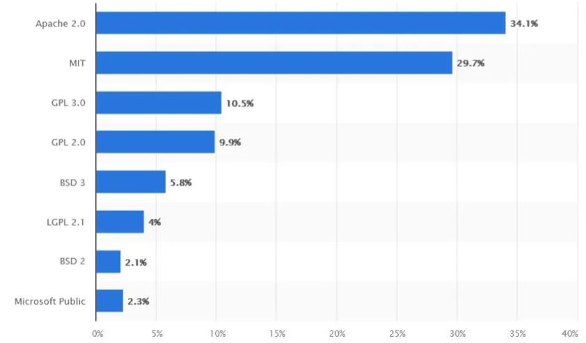

# 오픈소스 소프트웨어 보고서

## 1. 개요

오픈소스 소프트웨어(Open Source Software, OSS)는 소스 코드가 공개되어 누구나 자유롭게 사용, 수정, 배포할 수 있는 소프트웨어를 의미합니다. 오픈소스 소프트웨어는 개발자 및 사용자가 자유롭게 참여하고 협력할 수 있게 해주며, 종종 커뮤니티 중심으로 발전합니다. 이러한 특성 덕분에 오픈소스 소프트웨어는 상용 소프트웨어에 비해 비용 면에서 유리하고, 커스터마이징 및 확장성에서 많은 장점을 제공합니다.

## 2. 오픈소스 소프트웨어의 역사

오픈소스 소프트웨어의 개념은 1980년대 초반으로 거슬러 올라갑니다. 그 당시, 소프트웨어 개발자들이 코드의 공개와 자유로운 수정 권리를 주장하면서 오픈소스 운동이 시작되었습니다. 초기의 오픈소스 운동은 주로 UNIX와 GNU 프로젝트와 관련이 있습니다.

### 주요 역사적 사건들:
- **1983년**: 리차드 스톨만(Richard Stallman)은 GNU 프로젝트를 시작하며, 자유 소프트웨어의 중요성을 강조했습니다.
- **1991년**: 리누스 토르발스(Linus Torvalds)는 리눅스(Linux) 커널을 발표하며 오픈소스 소프트웨어의 중요한 전환점을 마련했습니다.
- **1998년**: "오픈소스"라는 용어가 처음 사용되었으며, 이로 인해 오픈소스 소프트웨어의 확산이 본격적으로 이루어졌습니다.

## 3. 오픈소스 소프트웨어의 장점

### 3.1. 비용 절감
오픈소스 소프트웨어는 대부분 무료로 제공되며, 사용자는 소프트웨어를 다운로드하고 설치하여 비용 없이 사용할 수 있습니다. 또한, 상용 소프트웨어처럼 라이선스 갱신이나 추가 비용이 발생하지 않습니다.

### 3.2. 투명성
오픈소스 소프트웨어는 코드가 공개되어 있기 때문에, 사용자와 개발자는 소프트웨어의 내부 동작을 완전히 이해할 수 있습니다. 이를 통해 보안 취약점을 빠르게 발견하고 수정할 수 있습니다.

### 3.3. 커스터마이징
오픈소스 소프트웨어는 누구나 코드를 수정할 수 있어, 사용자의 필요에 맞게 소프트웨어를 자유롭게 변경할 수 있습니다. 기업은 이를 통해 자신만의 맞춤형 솔루션을 개발할 수 있습니다.

### 3.4. 커뮤니티 지원
오픈소스 소프트웨어는 활발한 커뮤니티의 지원을 받습니다. 사용자는 포럼, 메일링 리스트 등을 통해 문제를 해결하거나, 새로운 기능을 제안하는 등 개발에 참여할 수 있습니다.

## 4. 오픈소스 소프트웨어의 단점

### 4.1. 기술 지원 부족
상용 소프트웨어는 보통 공식적인 기술 지원을 제공합니다. 그러나 오픈소스 소프트웨어는 대부분 커뮤니티 기반으로 지원을 받기 때문에, 신속한 문제 해결이나 전담 지원을 받기 어려울 수 있습니다.

### 4.2. 사용자 인터페이스(UI)의 불편함
일부 오픈소스 소프트웨어는 상용 소프트웨어보다 직관적이지 않거나, 사용자가 배우는 데 시간이 더 걸릴 수 있습니다. UI/UX가 중요한 상용 소프트웨어에 비해 기능 위주의 디자인이 많습니다.

### 4.3. 호환성 문제
오픈소스 소프트웨어는 종종 다양한 운영체제나 다른 소프트웨어와의 호환성 문제를 겪을 수 있습니다. 상용 소프트웨어는 대부분 다양한 플랫폼과의 호환성을 보장하지만, 오픈소스 소프트웨어는 특정 환경에 최적화되어 있을 수 있습니다.

## 5. 오픈소스 소프트웨어의 저작권

오픈소스 소프트웨어는 자유롭게 사용, 수정, 배포할 수 있지만, 각 소프트웨어는 특정 라이선스 하에 제공됩니다. 이 라이선스는 소프트웨어 사용자가 준수해야 하는 규칙을 정의합니다.

### 주요 오픈소스 라이선스:
- **Apache 라이선스**: 수정된 코드를 배포할 때 특허권에 대한 명시적 권리를 제공하며, 기업 사용에 유리한 라이선스입니다.
- **MIT 라이선스**: 소스 코드를 수정하거나 재배포할 수 있으며, 제한이 적고 상용화도 가능합니다.
- **GNU GPL (General Public License)**: 소스 코드를 수정하거나 배포할 때 동일한 라이선스 하에 배포해야 합니다. 이 라이선스는 "카피레프트" 조항으로 유명합니다.
- **BSD 라이선스**: 사용자가 소스 코드를 자유롭게 사용하고 수정할 수 있으며, 상용화도 가능합니다.
  

  
각 라이선스는 사용자가 소프트웨어를 어떻게 사용할 수 있는지에 대한 법적 규정을 명확히 하여, 개발자와 사용자 간의 권리를 보호합니다.

## 6. 결론

오픈소스 소프트웨어는 비용 절감, 투명성, 커스터마이징 등 여러 장점으로 많은 기업과 개인 개발자들에게 인기를 끌고 있습니다. 그러나 기술 지원 부족, 호환성 문제 등 단점도 존재하므로, 사용자는 필요와 상황에 맞는 소프트웨어를 선택해야 합니다. 오픈소스 소프트웨어는 앞으로도 기술 발전에 중요한 역할을 하며, 그 범위와 영향력은 계속 확장될 것입니다.

